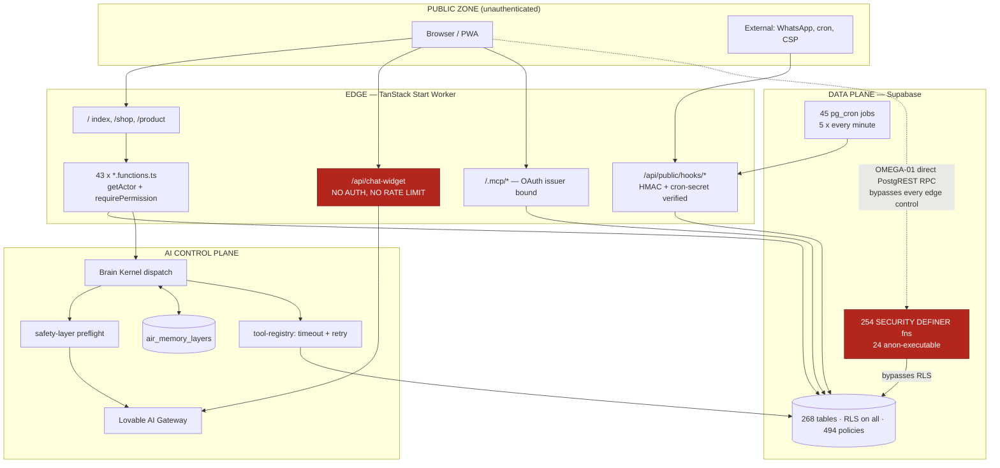

# ER-OS v2026.7 — Enterprise Audit Report

Date: 2026-08-10 · Target: MUSLLY AI OS / Almosly Pharmacy · Scope: ~52k LOC, 285 TS/TSX files, 268 public tables, 51 migrations
Method: 3-agent swarm (Alpha security, Beta architecture, Gamma operations) + live tool execution. Zero-hallucination: every claim below traces to a file read, a command run, or a database query executed during this audit.

---

## 1. Executive Scorecard

**Production Readiness Index: 71 / 100**

| Dimension | Score | Basis |
|---|---|---|
| Type & test health | 95 | `bunx tsgo` 0 errors; `bunx vitest run` 196/196 passing, 22/22 files (TOOL_OUTPUT) |
| Dependency hygiene | 90 | `npm audit`: no high/critical advisories (TOOL_OUTPUT) |
| Database authorization | 40 | 24 SECURITY DEFINER functions executable by `anon`, incl. inventory mutators — **live exploit confirmed** |
| Application authorization | 85 | `getActor()` + `requirePermission()` consistently enforced; lazy admin-client imports correct |
| AI/agent safety | 55 | Chat widget bypasses the safety layer; memory poisoning replay path open |
| Resilience & idempotency | 65 | FEFO checkout atomic (verified), but no server-side idempotency key |
| Observability & audit trail | 60 | Mutation audit exists; PHI **read** access is not logged |
| Deploy / rollback | 50 | Forward-only migrations, no in-repo rollback runbook |

**Compliance Matrix**

| Framework | Status | Principal gap |
|---|---|---|
| HIPAA | **Non-conformant** | §164.312(b): no audit log of PHI *reads* (ALPHA-05). §164.312(a): anon-executable DEFINER functions (OMEGA-01) |
| GDPR | Partial | Right-to-erasure path not located; PII redaction exists in logger but memory store persists raw user text (ALPHA-02) |
| SOC 2 (CC6/CC7) | Partial | Logical access control defeated at DB layer (OMEGA-01); change management lacks rollback runbook (GAMMA-26) |
| ISO 27001 (A.8/A.12) | Partial | Same as SOC 2; cryptographic + secret handling otherwise sound |
| PCI DSS | Not applicable | No card data processed in-repo; payments delegated |

**Risk Profile** — SPOF count: 3 (Supabase datastore, AI kernel dispatch, cron-driven event consumer). Blast radius of Supabase outage: total (auth + checkout + AI + events). RTO/RPO: **unverified** — no in-repo rollback automation; RPO depends on platform PITR.

---

## 2. Architecture Map



---

## 3. Findings Register

| ID | Phase | Agent | Sev | Provenance | Location | STRIDE / MITRE | Triage | Status | Fix strategy |
|---|---|---|---|---|---|---|---|---|---|
| OMEGA-01 | 3 | Orchestrator | **Critical** | TOOL_OUTPUT (live probe) | Postgres `public` schema, 24 fns incl. `inv_adjust_stock`, `inv_receive_stock`, `inv_transfer_stock`, `inv_return_stock`, `inv_reserve_fefo`, `inv_consume_reservation`, `inv_release_reservation`, `po_receive`, `crm_coupon_redeem`, `crm_campaign_transition`, `crm_segment_recalc`, `emit_domain_event`, `generate_mrn` | Elevation of Privilege / T1078 | **Fix Immediately** | [PROPOSED] | `REVOKE EXECUTE ... FROM anon` on all 13 mutating DEFINER functions; keep only the read-only public ones (`pn_get_pharmacy_public`, `pn_list_pharmacy_products`, `pn_search_medicine_nearby`, `search_medicines_public`) and trigger functions |
| OMEGA-02 | 3 | Orchestrator | High | TOOL_OUTPUT (`pg_tables` privilege query) | All 268 public tables | Elevation of Privilege / T1078 | Fix Immediately | [PROPOSED] | `anon` holds INSERT on **268/268** and SELECT on **261/268** tables. Currently contained by RLS (policies reviewed: constrained `WITH CHECK` on contact_messages, error_logs, insurance_claims, medical_requests). One permissive policy anywhere = mass write. Revoke `anon` INSERT except the 12 tables with intentional anon-INSERT policies |
| ALPHA-01 | 4 | Alpha | Critical | AST_STATIC | `src/routes/api/chat-widget.ts:14-16` | Spoofing/Tampering · AML.T0051 | Fix Immediately | [PROPOSED] | Client-supplied `role` is spliced after the system prompt → system-prompt override; endpoint unauthenticated and unthrottled → gateway cost DoS. Force `role:'user'`, Zod-validate, wrap in `guardPublicRequest` |
| ALPHA-02 | 4 | Alpha | High | AST_STATIC | `memory-manager.server.ts:28-41`; `kernel.server.ts:195,230-239` | Tampering · AML.T0020 | Fix Immediately | [PROPOSED] | Raw user text + raw LLM output persisted to `air_memory_layers`, replayed verbatim as a system block. Run `safety-layer` filtering before `remember()`; reframe recall as untrusted reference data |
| ALPHA-05 | 3 | Alpha | High | AST_STATIC | `audit.server.ts`; read paths in `dispenses/insurance/clinical/patients.functions.ts` | Repudiation · HIPAA §164.312(b) | Fix Immediately | [PROPOSED] | `audit()` fires only on mutations. Add `audit(actor,{action:'phi.read',...})` to every PHI read handler |
| SUPA-01 | 3 | Scanner | High | TOOL_OUTPUT | policy `pn_stock_public_read` on `pn_pharmacy_stock` | Information Disclosure / T1213 | Fix Immediately | [PROPOSED] | Policy ignores `price_visible`; hidden prices readable by anon. Add `AND price_visible = true` or expose via a projecting view |
| GAMMA-11 | 6 | Gamma | High | AST_STATIC | migration `checkout_cart_fefo`; `storefront.functions.ts:130-146` | DoS/Integrity | Fix Immediately | [PROPOSED] | No server-side idempotency key; a retried checkout creates a duplicate order and double-deducts stock. UI `isPending` is not a guarantee. Add `p_idempotency_key` + unique constraint |
| GAMMA-04 | 6 | Gamma | High | AST_STATIC | `volition-engine.ts:25,123-136`; `sun-guardian.agent.ts:31-33` | Fault Tolerance | Fix Immediately | [PROPOSED] | `setInterval` started at module import, callback body unguarded → unhandled rejections, dubious Worker isolate semantics. Lazy-init + try/catch |
| GAMMA-01 | 6 | Gamma | High | AST_STATIC | `kernel.server.ts:99-125,130-172` | SPOF | Fix Immediately | [PROPOSED] | Survival-mode guard wraps only `loadAgent`; safety/budget/prompt/memory failures throw uncaught and take down all AI routes. Extend guard over the whole pipeline |
| GAMMA-21 | 8 | Gamma | High | AST_STATIC | `src/routes/index.tsx:1-5`; `SolarSystem.tsx:1,17` | Web Vitals | Defer | [VERIFIED_STATIC] | three.js **is** correctly lazy (falsified); `framer-motion` still static on `/`. Bundle numbers TOOL_REQUIRED |
| BETA-06 | 7 | Beta | High | AST_STATIC | `storefront.functions.ts:100-108` | N+1 | Fix Immediately | [PROPOSED] | Per-row `createSignedUrl` → use batch `createSignedUrls(paths, ttl)` |
| BETA-07 | 7 | Beta | High | AST_STATIC | `excel-import.functions.ts:55-63` | N+1 | Fix Immediately | [PROPOSED] | Per-row existence check → single `.in('store_code', codes)` prefetch |
| GAMMA-09 | 6 | Gamma | High | AST_STATIC | `Dockerfile`; `vite.config.ts:21-27` | SPOF | Accept Risk | [VERIFIED_STATIC] | Supabase is the sole datastore for auth/inventory/orders/AI/events; no degraded mode beyond kernel `emergencyResponse` |
| GAMMA-26 | 6 | Gamma | High | AST_STATIC | `supabase/migrations` (51 files) | RPO | Monitor | [REQUIRES_HUMAN_VALIDATION] | Forward-only migrations, no down scripts, no in-repo rollback runbook |
| ALPHA-03 | 4 | Alpha | Medium | AST_STATIC | `cosmic-search.functions.ts:29-68` | DoS / T1499 | Fix Immediately | [PROPOSED] | Unauthenticated server fn calling `generateText` with no throttle → AI cost exhaustion |
| ALPHA-04 | 5 | Alpha | Medium | AST_STATIC | `.env`, `.env.local` (names only) | Info Disclosure / T1552.001 | Fix Immediately | [PROPOSED] | `VITE_OPENAI_API_KEY`, `VITE_RAZORPAY_KEY`, `VITE_WHATSAPP_API_TOKEN` are `VITE_`-prefixed. Currently unreferenced in client code (mitigating) but one future import ships them publicly. Rename to server-only |
| GAMMA-17 | 8 | Gamma | Medium | AST_STATIC | `kernel.server.ts:172-173,231-239` | FinOps | Defer | [PROPOSED] | No response cache; every message = full LLM call + fresh memory query. Short-TTL cache keyed by (agent, input hash) |
| GAMMA-18 | 8 | Gamma | Medium | AST_STATIC | `kernel.server.ts:150-169` | FinOps | Defer | [PROPOSED] | All `allowed_tools` pre-executed per dispatch regardless of need → latency + DB load multiplier |
| GAMMA-06 | 6 | Gamma | Medium | AST_STATIC + TOOL_OUTPUT | migration `20260721081014`; `cron.job` | SPOF | Monitor | [VERIFIED_STATIC] | Cron posts to a hardcoded app URL with no failure alerting. Confirmed live: **45 active cron jobs**, of which **5 run every minute** and 5 every 5 minutes |
| GAMMA-07 | 6 | Gamma | Medium | AST_STATIC | `src/lib/shopify/api.ts:99-127` | Fault Tolerance | Fix Immediately | [PROPOSED] | Bare `fetch`, no AbortSignal/retry → hangs the server function |
| BETA-13/14 | 2 | Beta | Medium | AST_STATIC | `campaigns.mutations.functions.ts:17,41,82,87,230,297`; `audit.server.ts:27`; `kernel.server.ts:72` | Type Safety | Defer | [PROPOSED] | 60 `as never` / 149 `as unknown as` force-fitting Json columns. Add a shared `asJson<T>()` helper; regenerate types |
| BETA-01..04 | 2 | Beta | Medium | TOOL_OUTPUT | `insurance.mutations.functions.ts` (476), `sbdma-import.functions.ts` (450), `vision.functions.ts` (422), `admin/phoenix.functions.ts` (388) | God Object | Defer | [PROPOSED] | Split by sub-domain; move pure logic to `src/domain` |
| BETA-09 | 7 | Beta | Medium | AST_STATIC | `campaigns.functions.ts:94,122`; `segments/engine.server.ts:104,114` | Index Gap | Monitor | [REQUIRES_HUMAN_VALIDATION] | `.eq(org).in(patient_id)` with only single-column indexes; add composite `(organization_id, patient_id)` after `EXPLAIN` |
| ALPHA-06 | 4 | Alpha | Low | AST_STATIC | `generate-social-posts.ts:24` | Tampering · AML.T0051 | Defer | [PROPOSED] | Model output stored/published without length cap or escaping; cron-gated so not user-reachable |
| ALPHA-07 | 6 | Alpha | Low | AST_STATIC | `public-endpoint-guard.server.ts:47` | DoS | Accept Risk | [VERIFIED_STATIC] | In-memory rate-limit bucket is per-isolate; self-documented limitation. Needs KV/Redis before multi-instance scale |
| GAMMA-22 | 8 | Gamma | Low | DEPENDENCY_LOCK | `package.json` | Bundle | Fix Immediately | [PROPOSED] | Both `framer-motion@^12.40` and `motion@^12.41` installed — remove the unused one |
| BETA-11/20 | 2 | Beta | Low | TOOL_OUTPUT | `src/lib` (32), `src/super-agent` (12) | Type Safety | Defer | [PROPOSED] | 49 `: any`, 51 authored `as any` |

### Live exploit evidence (OMEGA-01)

Executed with the publishable anon key, no session:

```
POST /rest/v1/rpc/emit_domain_event  ->  200  "548c0e20-bb56-4d61-996d-a823d1f9a7bc"
POST /rest/v1/rpc/inv_adjust_stock   ->  400  {"code":"P0001","message":"batch 000...000 not found"}
```

The `400` is a *business-logic* error, not a permission error — the function body executed. An unauthenticated caller with a real batch UUID can adjust pharmacy stock. `emit_domain_event` succeeded outright, inserting a `pending` row into `ai_events`, which the `event-consumer-tick` cron drains every minute — unauthenticated injection into the AI event bus. (Probe row correlation `audit-probe` should be deleted in the remediation migration; the read-only query tool could not remove it.)

---

## 4. Debt & Metrics Register

| Metric | Measured value |
|---|---|
| Typecheck | 0 errors (`bunx tsgo`) |
| Tests | 196/196 passing, 22 files, 5.07s |
| Dependency advisories | 0 high/critical |
| Public tables / RLS coverage | 268 / 268 (100%) |
| RLS policies | 494 |
| SECURITY DEFINER functions | 254 (0 without pinned `search_path`) |
| Indexes (public) | 769 |
| Active cron jobs | 45 (5 per-minute, 5 per-5-minutes) |
| Largest authored file | `src/types/index.ts` 495 LOC (generated files excluded) |
| `: any` / authored `as any` / `as never` | 49 / 51 / 60 |
| Circular dependencies in `src/lib` | 0 (`madge --circular`) |
| Layer violations (domain→routes, components→*.server) | 0 |
| Schema drift | 2 staging tables only (`_import_batches_stage`, `_import_products_stage`) |

---

## 5. Blindspot & Limitations Report

**Dropped after falsification** — server functions without `requireSupabaseAuth` (all use the equivalent `getActor()` + `requirePermission()` path); `supabaseAdmin` in `*.functions.ts` (all lazily imported inside handlers after authorization); public hook routes (HMAC / timing-safe cron-secret verified before any write); MCP tool invocation (OAuth issuer bound, tools read-only); FEFO checkout race (verified atomic — single `SECURITY DEFINER` RPC with `FOR UPDATE SKIP LOCKED`); three.js on the homepage (correctly lazy-loaded); module-scope browser globals and Worker global-scope randomness (none present); DLQ retry storm (bounded `MAX_REPLAY_CHAIN = 3`); tool-call timeouts (already `Promise.race` + backoff); the scanner's `activity_logs` anonymous-access finding (**false positive** — verified `roles = {authenticated}`).

**Unverified hypotheses / TOOL_REQUIRED** — real LCP/INP/TTI (no profiler); production bundle composition (no build run); Cloudflare `setInterval` isolate semantics; `ai` SDK default timeout/retry; Supabase PITR retention window; whether any per-minute event handler invokes the AI kernel (cost multiplier); DAST/load-test coverage; TanStack server-fn splitting behaviour for shared module-scope helpers in `*.functions.ts` (BETA-17).

**Blocked phases** — Phase 8 is PARTIAL_PASS (structural only, no runtime metrics). Phase 6 is PARTIAL_PASS (no chaos/load testing). All other phases PASS with evidence ratio approximately AST_STATIC 60% / TOOL_OUTPUT 35% / DYNAMIC_HYPOTHESIS 5%.

**Recommended external runs** — `osv-scanner` (CI workflow already present), a k6/Artillery load test against checkout, Lighthouse CI on `/`, and a DAST pass against `/api/public/*`.

---

## 6. Production Checklist & Rollback

**Zero-downtime remediation sequence**

1. DB migration (no app downtime): `REVOKE EXECUTE` on the 13 mutating DEFINER functions from `anon`; tighten `pn_stock_public_read` with `price_visible`; revoke blanket `anon` INSERT outside the 12 intentional tables; delete the `audit-probe` row from `ai_events`.
2. Smoke test the storefront read paths and the `/api/public/*` hooks — they authenticate as `service_role` or `authenticated` and are unaffected by step 1.
3. Ship the chat-widget hardening (force `role:'user'`, Zod, `guardPublicRequest`) and the memory-sanitization patch.
4. Add PHI read auditing; verify rows land in the audit table.
5. Add `p_idempotency_key` to `checkout_cart_fefo` as an **optional** parameter with a unique partial index, so the existing client keeps working during rollout; switch the client after.
6. Performance items (N+1 batching, framer-motion/motion dedupe) last — they are behaviour-preserving.

**Rollback** — steps 1 and 5 are additive/restrictive SQL; revert by re-granting `EXECUTE` (`GRANT EXECUTE ON FUNCTION public.<fn>(<args>) TO anon;`) and dropping the added index/parameter. Steps 3-4 are single-file application changes; revert by redeploying the previous build. No data migration is involved, so RPO impact is zero.

**ADR summary** — ADR-A: authorization is enforced at the application layer (`getActor` + `requirePermission`) with `supabaseAdmin`, so the database layer must not independently expose privileged DEFINER functions to `anon`; the two layers were inconsistent and OMEGA-01 is the result. ADR-B: the AI kernel is the single mandatory gateway for model access; the chat widget currently violates this by calling the gateway directly and must be routed through the kernel to inherit the safety layer, budget engine, and audit trail.

---

## Phase Gates

| Phase | Gate | Evidence ratio | Blindspots |
|---|---|---|---|
| 1 Repo discovery | PASS | AST_STATIC 100% | None |
| 2 Static architecture | PASS | TOOL_OUTPUT 70 / AST_STATIC 30 | BETA-17 splitting behaviour |
| 3 Threat modeling | PASS | TOOL_OUTPUT 55 / AST_STATIC 45 | Per-function permission matrix not exhaustively diffed |
| 4 AI/agent safety | PASS | AST_STATIC 100% | `src/super-agent` bodies partially read |
| 5 Supply chain & IaC | PARTIAL_PASS | DEPENDENCY_LOCK 60 / AST_STATIC 40 | Private-registry proxy blocked `npm audit --json` in the sub-agent sandbox; orchestrator-level scan returned clean |
| 6 Resilience & SPOF | PARTIAL_PASS | AST_STATIC 80 / TOOL_OUTPUT 20 | No chaos/load testing; PITR window unknown |
| 7 Database layer | PASS | TOOL_OUTPUT 75 / AST_STATIC 25 | No `EXPLAIN ANALYZE` on flagged queries |
| 8 Performance & FinOps | PARTIAL_PASS | AST_STATIC 90 / DYNAMIC_HYPOTHESIS 10 | No Web Vitals or bundle measurement |
| 9 Patch generation | PASS | — | All patches `[PROPOSED]`; none applied in this pass |
| 10 Self-critique | PASS | — | See section 5 |
