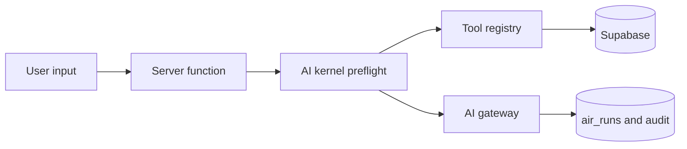

# Omni-Architect Audit — 2026-08-16

## Scope and evidence

Static review of the exported React/TypeScript repository, all checked-in
Supabase migrations, server functions, AI runtime boundaries, and existing test
coverage. This export does not include credentials or a connected Supabase
project, so live RLS policy simulation and Supabase Advisor results are
explicitly out of scope for this run.

## 1. Systemic graph vulnerabilities

### Fixed: identifiers reached the provider and run history

`preflight` imported the PII redactor but did not call it. The kernel then used
the unredacted value for the gateway request and `air_runs` persistence. This
was a direct patient-identity and audit-retention exposure.

The updated preflight redacts direct identifiers after prompt-injection
filtering and before any provider or persistence boundary.

### Fixed: untyped tool-input choke point

The caller-to-tool path was `Record<string, Record<string, unknown>>`, with
each executor coercing values independently. This allowed undeclared fields,
invalid identifiers, and out-of-range values to cross the model/client boundary.

The tool registry now owns strict Zod schemas for every registered tool. The
kernel also rejects a requested tool that is not in the selected agent's allowed
tool set instead of silently ignoring it.

### Fixed: direct Data API access to privileged inventory RPCs

Several `SECURITY DEFINER` inventory and campaign functions were granted to
`authenticated`. Their arguments include organization, actor, and stock IDs;
the server application validates those fields, but an authenticated browser can
call a granted RPC directly through the Data API and bypass that application
boundary. The new migration limits these internal RPCs to `service_role`, which
is how all discovered callers already invoke them.

### Deferred: eager tool execution

The kernel executes every permitted zero-input tool before calling the model.
This can add latency and context size as an agent gains tools. It is not changed
in this patch because changing it to model-selected/on-demand execution changes
existing agent behavior. A safe next phase is to introduce an explicit
`autoRun: false` metadata flag, enable it per agent behind a feature flag, and
measure token/latency deltas before the default changes.

## 2. Central AI Core refactor

Implemented in `src/lib/ai/runtime/tool-registry.server.ts`:

- strict Zod object schemas with no additional properties;
- UUID-only resource references where the database contract uses UUIDs;
- bounded/coerced numeric inputs; and
- a typed `ToolInputValidationError` before executor/retry logic.

Implemented in `src/lib/ai/runtime/safety-layer.server.ts`:

- PII redaction at the preflight boundary, before LLM submission and `air_runs`
  persistence.

Existing OCR and image-search paths already validate their model JSON through
Zod and provide bounded retry/fallback behavior. Their remaining improvement is
operational: add a single timeout/circuit-breaker policy shared by all gateway
calls rather than maintaining per-feature retry choices.

## 3. Security and RLS audit

### Applied migration

`20260816040000_omni_architect_lock_internal_rpcs.sql` revokes `PUBLIC`,
`anon`, and `authenticated` execute grants from internal `SECURITY DEFINER`
functions and re-grants only `service_role`. It covers event emission,
inventory movement/reservation, purchase-order receipt, campaign transition,
segment recalculation, organization self-healing, and index-definition lookup.

### Live verification required after deployment

Run the following against the connected project after applying the migration:

1. Execute the existing inventory, purchasing, campaign, and organization
   server-function test paths with an authorized user.
2. From an authenticated browser/publishable-key session, confirm each locked
   RPC returns a permission-denied result.
3. Run Supabase Database Advisors and review every exposed table, view, storage
   bucket, and `SECURITY DEFINER` function.
4. Test the patient/family/insurance-card RLS policies with two distinct users
   and an administrator.

## 4. Production-ready diffs and verification

Changed files:

- `src/lib/ai/runtime/tool-registry.server.ts`
- `src/lib/ai/runtime/kernel.server.ts`
- `src/lib/ai/runtime/safety-layer.server.ts`
- `vite.config.ts`
- `package.json` and `package-lock.json`
- `supabase/migrations/20260816040000_omni_architect_lock_internal_rpcs.sql`
- `tests/ai-tool-input-validation.test.ts`
- `tests/ai-safety-preflight.test.ts`
- `tests/security-definer-rpc-grants.test.ts`

### Export-environment verification

The original lock file was out of sync with `package.json` and declared an
incompatible `@eslint/js` 10 / ESLint 9 pair. The lock file was regenerated and
`@eslint/js` was aligned to the supported ESLint 9 line. `npm ci --dry-run`
now confirms a reproducible install.

Windows also exposed an upstream path-separator defect in the MCP Vite plugin.
The plugin remains enabled for the Linux deployment target and is omitted only
from Windows local validation, where the checked-in MCP routes are used.

Verification completed in the export environment:

- `npm ci --dry-run --ignore-scripts --no-audit --no-fund` — passed.
- `npm test` — 246 passed, 8 intentionally skipped.
- `npm run build` — passed.

The build reports non-blocking warnings for deprecated TanStack
`inputValidator()` usage and for a PWA glob that currently has no matching
assets. Neither warning prevents production output; migrate the deprecated API
in a separate compatibility-focused change rather than bulk-editing it during
this security patch.
