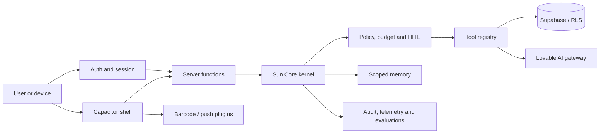

# Sun Core capability baseline

**Assessment date:** 2026-08-16  
**Scope:** exported repository and locally installed build environment only.

## Evidence vocabulary

- **VERIFIED_REPOSITORY** — source, manifest, migration, or configuration is present.
- **VERIFIED_RUNTIME** — local install, tests, or production build completed.
- **UNVERIFIED** — a dependency or configuration exists, but no live credential or service call was made.
- **BLOCKED** — requires a connected Supabase project, production credentials, or a physical Android environment.

No dependency in this document is treated as an active external service merely
because it appears in `package.json`.

## Capability registry

| Tool ID | Category | Provider / implementation | Evidence | Data / authority boundary | Status |
| --- | --- | --- | --- | --- | --- |
| `ai.kernel` | AGENT, MODEL | `src/lib/ai/runtime/kernel.server.ts` + AI SDK | VERIFIED_REPOSITORY | Server-only gateway key; organization actor required | AVAILABLE |
| `ai.tools.internal` | DATABASE, AGENT | `src/lib/ai/tools.server.ts` + tool registry | VERIFIED_REPOSITORY, VERIFIED_TEST | Organization-scoped; strict Zod inputs; read-only declared tools | ACTIVE |
| `ai.patient-tools` | HEALTHCARE, AGENT | `src/lib/ai/tools/patient-tools.server.ts` | VERIFIED_REPOSITORY | User identity required for order lookup; public catalogue is limited | AVAILABLE |
| `ai.vision` | VISION, OCR | `src/lib/ai/vision.server.ts` | VERIFIED_REPOSITORY | Server-only AI gateway; Zod output validation | AVAILABLE |
| `ai.clinical-grounding` | HEALTHCARE, RAG | `src/lib/ai/runtime/clinical-rag.server.ts` | VERIFIED_REPOSITORY | Clinical decision support only; live provider not verified | UNVERIFIED |
| `ai.memory` | MEMORY | `memory-manager.server.ts`, `ego-memory.server.ts` | VERIFIED_REPOSITORY | Organization/client-scoped; PII redaction in repository | AVAILABLE |
| `ai.approvals` | SECURITY, AGENT | `hitl.server.ts`, `hitl.functions.ts` | VERIFIED_REPOSITORY | High-risk actions require an approval record | AVAILABLE |
| `supabase.auth` | AUTHENTICATION | Supabase clients and auth middleware | VERIFIED_REPOSITORY | Publishable key client; service role server-only | UNVERIFIED |
| `supabase.rls` | DATABASE, SECURITY | 70 SQL migrations | VERIFIED_REPOSITORY | Live policy behavior requires connected-project tests | BLOCKED |
| `supabase.storage` | STORAGE | migration policies and upload modules | VERIFIED_REPOSITORY | Signed/authorized access is implementation-specific | UNVERIFIED |
| `mcp.muslly` | MCP | `.lovable/mcp/manifest.json`, `src/lib/mcp` | VERIFIED_REPOSITORY | OAuth manifest exposes five read-oriented tools | UNVERIFIED |
| `events.jobs` | QUEUE, SCHEDULER | event handlers and public cron hooks | VERIFIED_REPOSITORY | HMAC-protected cron routes; runtime schedule not verified | UNVERIFIED |
| `whatsapp` | MESSAGING, WEBHOOK | `src/lib/whatsapp`, webhook routes | VERIFIED_REPOSITORY | Secret-verified webhook path; Meta configuration unverified | UNVERIFIED |
| `email` | EMAIL | Lovable email routes and React Email | VERIFIED_REPOSITORY | Server-side provider key; delivery unverified | UNVERIFIED |
| `push` | NOTIFICATIONS | Capacitor Push Notifications | VERIFIED_REPOSITORY, VERIFIED_BUILD | Plugin synced into the APK; Firebase/device delivery remains unverified | PARTIAL |
| `barcode` | FILES, IMAGE | ML Kit Capacitor scanner | VERIFIED_REPOSITORY, VERIFIED_BUILD | Native plugin synced and APK built; physical-camera validation remains | PARTIAL |
| `pwa.offline` | CACHE, FILES | Vite PWA + cart queue | VERIFIED_REPOSITORY, VERIFIED_RUNTIME | Browser cache; no PHI offline policy evidence found | AVAILABLE |
| `observability` | OBSERVABILITY | Sentry, logger redaction, AI telemetry | VERIFIED_REPOSITORY | Sentry DSN/configuration not verified | UNVERIFIED |
| `ci.security` | CI_CD, SECURITY | GitHub CI and OSV scanner workflows | VERIFIED_REPOSITORY | Workflow execution state not available in export | UNVERIFIED |

## Capability graph

## Android adaptation map

| Web capability | Android decision | Evidence / constraint |
| --- | --- | --- |
| React/TanStack UI | **Reuse through Capacitor initially** | Capacitor configuration and native plugins already exist. |
| Supabase Auth and RLS | **Reuse server and client-safe keys** | No service-role or AI gateway credentials may enter the APK. |
| AI kernel and privileged tools | **Server API only** | Current kernel is server-only and already has policy/HITL boundaries. |
| Barcode scanning | **Native Capacitor plugin** | ML Kit Capacitor integration is present; native Android project must be generated and verified. |
| Push notifications | **Native Capacitor plugin** | Registration code exists; FCM/project configuration remains unverified. |
| Offline cart/PWA cache | **Reuse only non-PHI flows** | Existing browser queue is a starting point; medical data needs a separate retention decision. |

### Current mobile decision

**EXTEND_EXISTING:** a Capacitor Android shell was generated in `android/` from
the existing configuration. A native rewrite is not yet justified by repository
evidence, while Capacitor dependencies, barcode, and push integrations already
exist.

## Governance gaps to resolve before broader autonomy or mobile release

1. `loadCapabilities` enables execution, tool calls, and learning when no
   capability row exists. This preserves fresh-organization usability but is
   not a deny-by-default posture. Any change must be staged because it affects
   current agents.
   A failed or malformed capability lookup now fails closed and produces the
   Kernel's no-tool emergency response; it is not treated as an absent row.
2. Tool metadata covers the internal AI registry, but not every MCP, webhook,
   messaging, or browser-facing integration in a single canonical record.
3. Live RLS, storage, webhook, and MCP authorization cannot be verified from
   this export without the connected Supabase project and test identities.
4. Capacitor now uses a dedicated TanStack SPA-shell build that emits
   `dist/client/index.html`; `cap sync android` passes. Native RPC calls are
   routed to the HTTPS backend, with a narrow Capacitor-origin CORS allowlist
   and CSRF validation. The ordinary web build remains server-backed.
5. Debug APK build and manifest/signature inspection pass. Release signing,
   physical-device validation, FCM delivery, and Play Store AAB remain pending.

## Governance hardening applied

- Capability records are validated at the database-to-kernel boundary with a
  strict schema. Query errors and malformed rows deny dispatch without calling
  a model, tool, memory store, or privileged database operation.
- Every executable internal tool is now required to have both policy metadata
  and a strict Zod input contract. An unregistered tool key fails before its
  input can reach an executor, and execution timers are released after each
  attempt.
- The AI policy, budget, and capability write policies now require both an
  administrative role and membership in the target organization. This closes
  cross-organization writes through the authenticated Supabase Data API.

## Verified local baseline

- `npm ci --dry-run --ignore-scripts --no-audit --no-fund` — passed.
- `npm test` — 260 passed; 8 intentionally skipped.
- `npm run build` — passed.
- `npm run build:android` and `npx cap sync android` — passed.
- Gradle `assembleDebug` — passed; package `com.ympharma.app`, min SDK 24,
  target/compile SDK 36, Debug APK Signature Scheme v2 verified.

## Next safe implementation

Install the Debug APK on a physical Android device and validate login, server
RPC, barcode camera, deep links, offline messaging, and push delivery. Before
store release, create an owner-controlled release keystore and generate an AAB;
do not reuse the Debug signature. None of these steps requires changing Oracle.
