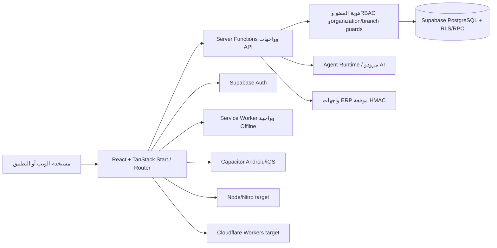

# معمارية YmPharma كما هي في المستودع

**تاريخ التوثيق:** 2026-10-10. هذه خريطة للشيفرة الحالية، لا تصميم مستهدف ولا إثبات لتشغيل كل المسارات على الإنتاج.

## نظرة عامة

الرسم يبين المكونات التي ظهرت في المصدر. لا يعني أن كل سهم مغطى باختبار تكامل أو أن كل إعداد بيئة نشر نشط.

## الواجهة والتوجيه

- مشروع TypeScript وReact يستخدم TanStack Start/Router عبر Vite. المسارات العامة تشمل المتجر والمنتج، بينما `_authenticated` يحرس صفحات المنظمة مثل المخزون والشراء والتأمين والوصفات والتحليلات.
- مستند الجذر يضبط العربية وRTL. مكونات حالة مشتركة تقدم loading/empty/error، وهناك Bottom Navigation للهاتف وبعض قواعد reduced-motion.
- توجد فجوة بين الواجهات والخلفية في عدة وحدات: صفحة التقارير محاكاة، `/ai-chat` يعرض بيانات ثابتة، والمخزون لا يقدم شاشات تشغيل كاملة رغم وجود RPCs.

## منطق الخادم والتكاملات

- Server Functions في `src/lib/*` تستخدم `getActor` و`requireOrg` و`requirePermission` بدرجات متفاوتة. بعض المسارات تستخدم عميل `supabaseAdmin`، لذلك يجب أن يكون فحص المنظمة والفرع داخل كل وظيفة أو RPC؛ لا يكفي الاعتماد على RLS إذا جرى تجاوزها بعميل service-role.
- ERP يملك واجهات `/api/public/erp/v1/*` مع توقيع HMAC وidempotency وعمليات queue/reconcile. وجود طبقة API لا يثبت بعد ربط كل طلب متجر تلقائياً بالطابور أو اختبار ACK في قاعدة فعلية.
- Agent Runtime يتضمن kernel وسياسات وregistry للقدرات وسلامة وموازنة، مع تخزين `air_runs` وطلبات HITL. واجهة الموافقة التشغيلية غير مكتملة، ومحادثة `/ai-chat` المنفصلة demo.

## البيانات

- Supabase PostgreSQL هو المصدر الأساسي للهوية والبيانات التشغيلية. الترقيات تستخدم مخططات `public` و`ym` و`ym_private`، مع ترحيلات SQL في `supabase/migrations` واستخدام Drizzle في أجزاء ERP.
- المجالات الظاهرة تشمل catalog/products، المخزون والدفعات والحركات، أوامر الشراء والموردين، الطلبات والسلة، الوصفات والصرف، التأمين والمطالبات، billing ledger، AI governance، وسجلات التشغيل.
- عمليات قاعدة البيانات الحساسة تعتمد RPCs و`SECURITY DEFINER` وRLS. يجب مراجعة `EXECUTE` grants مع كل Server Function؛ تدقيق هذه المهمة وجد تعارض checkout و`po_receive`، وانحراف أعمدة دفتر الأستاذ.
- توجد ترحيلات كثيرة بين تاريخها المحلي وسجل البيئة الحية. migration PR #14 لم تُطبق على قاعدة البيانات الحية في هذا العمل.

## المصادقة والصلاحيات

- الواجهة تستخدم Supabase Auth. `session.server.ts` يحمّل actor والعضوية والأدوار ويعرّف مصفوفة صلاحيات.
- RLS مفعّل على الجداول التي فُحصت في Supabase، لكن لم يكن `FORCE ROW LEVEL SECURITY` مفعلاً على أي من الجداول التي شملها الجرد. هذا لا يعني وحده وجود اختراق؛ أدوار المالك والخدمة تتجاوز RLS بطبيعتها، لذلك يلزم تدقيق grants والوظائف التي تستخدم service-role.
- عزل المؤسسة أو الفرع غير مضمون في كل وظيفة. بعض عمليات التأمين تستخدم فلترة بالمعرّف فقط، وبعض تعديلات المخزون تقبل `branch_id` بعد التحقق من المنظمة فقط. توجد أسماء صلاحيات غير متسقة بين طبقة الخادم وسياسات SQL.
- توجد طبقة audit دائمة وأخرى احتياطية في الذاكرة. يلزم إثبات وصول كل العمليات الحساسة إلى سجل دائم واختبار رفض القراءة عبر المؤسسات.

## البناء والاستضافة

| الهدف | المسار الحالي | حالة الإثبات |
|---|---|---|
| Node/Docker | Nitro `node-server` مع `bun run build` | بناء محلي نجح بعد فصل هدف Workers |
| Cloudflare Workers | `@cloudflare/vite-plugin` مع TanStack server entry و`bun run build:cloudflare` | بناء Worker، Wrangler `--dry-run` ومعاينة Workerd نجحت محلياً؛ لم يحدث deploy |
| PWA | `vite-plugin-pwa` وService Worker مع precache وfallback `/offline` | تثبيت ملفات/صفحة fallback مثبت؛ لا يثبت sync لكل البيانات |
| Capacitor | إعداد Android/iOS وإعادة توجيه server functions إلى HTTPS على native | إعداد واختبارات helper جزئية؛ لا إثبات ميداني للأجهزة |

Cloudflare Vite plugin يدير بيئة SSR ومخرجات Worker. `scripts/cloudflare-target.mjs` يعزل الهدف عن Nitro. لا تستخدم `bun run build` كأمر بناء Worker؛ هذا أمر هدف Node.

## مسار بيانات نموذجي وحدوده

مسار الطلب يبدأ من واجهة السلة ثم `storefront.functions.ts` ويستدعي RPC `checkout_cart_fefo`، التي تنشئ الطلب وتخصم مخزون FEFO وتفرغ السلة. لكن migration أحدث يقصر تنفيذ RPC على `service_role` بينما الاستدعاء الحالي صادر من جلسة مستخدم؛ يجب حسم التعارض قبل اعتبار checkout عاملاً. ولا يظهر من هذا التدفق تسجيل دفع إلكتروني أو قيد محاسبي POS.

## مراجع داخل المستودع

- `vite.config.ts`, `wrangler.jsonc`, `scripts/cloudflare-target.mjs`, `src/server.ts`
- `src/lib/session.server.ts`, `src/lib/insurance.mutations.functions.ts`, `src/lib/inventory.mutations.functions.ts`
- `src/lib/storefront.functions.ts`, `src/lib/purchasing.functions.ts`, `src/lib/ai/runtime/`
- `supabase/migrations/`, `drizzle/migrations/`, `.github/workflows/`
- [`CLOUDFLARE-10021-REPAIR.md`](../deployment/CLOUDFLARE-10021-REPAIR.md)
